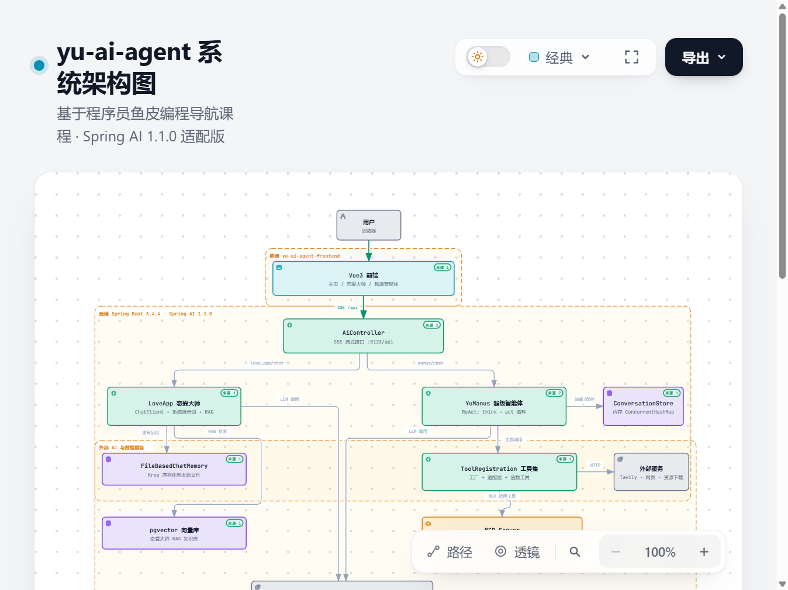

# yu-ai-agent

基于 Spring AI 的 AI 智能体全栈项目，包含「AI 恋爱大师」和「AI 超级智能体（类 Manus）」两个应用。

> 本项目是学习 [程序员鱼皮](https://yuyuanweb.com/) 的 [编程导航](https://www.code-nav.cn/) 课程中 AI 智能体相关内容的练手项目。
> 原课程基于较早版本的 Spring AI，本项目在此基础上做了一些**更改与适配**：
> - 升级到 **Spring AI 1.1.0**（Spring Boot 3.4.4 / Java 21），并适配 Spring AI Alibaba `1.1.0.0-RC2`；
> - 实现了自主可控的 ReAct 工具调用循环（`ToolCallAgent`），并修复了模型直接回答与最终文本总结的问题；
> - 新增基于 `chatId` 的多轮会话记忆（`ConversationStore`）；
> - 新增 Vue 3 前端，支持 SSE 流式对话；
> - 扩展了工具集（PDF 生成支持图片嵌入、MCP 图片搜索等）。

---

## 系统架构图

下图展示了项目的整体架构：前端 → 后端控制器 → 两大应用（恋爱大师 / 超级智能体）→ 工具系统、记忆存储与外部 AI/数据服务。



> 👉 **交互式架构图**（支持深色/浅色主题切换、节点聚焦、缩放与 PNG/SVG 导出）：
> [在线预览](https://htmlpreview.github.io/?https://raw.githubusercontent.com/LCZcoding/yu-ai-agent-changed/master/.archify/architecture-yu-ai-agent-20261007/architecture.html) · [源文件](./.archify/architecture-yu-ai-agent-20261007/architecture.html)

---

## 一、技术栈

### 后端
- **Spring Boot 3.4.4** + **Java 21**
- **Spring AI 1.1.0**（BOM 统一管理）
- **Spring AI Alibaba 1.1.0.0-RC2**（通义千问 DashScope 接入 + Agent Framework）
- **Ollama**（本地模型支持）
- **MCP**（Model Context Protocol，客户端接入远程工具）
- **iText 9**（PDF 生成，含图片嵌入）
- **Jsoup**（网页抓取）、**Unirest**（HTTP 客户端）、**Hutool**（工具库）
- **Knife4j / OpenAPI 3**（接口文档）
- **PostgreSQL + pgvector**（向量存储，可选）
- **Kryo**（对象序列化，用于文件记忆）

### 前端
- **Vue 3** + **Vue Router 4**
- **Vite 5**
- **Axios**（HTTP 请求）
- 原生 `EventSource`（SSE 流式接收）

---

## 二、项目结构

```
yu-ai-agent/
├── src/main/java/com/lcz/yuaiagent/
│   ├── advisor/          # 增强器（日志、复读）
│   │   ├── MyLoggerAdvisor.java
│   │   └── ReReadingAdvisor.java
│   ├── agent/            # 智能体核心（状态机 + ReAct 循环）
│   │   ├── model/AgentState.java
│   │   ├── BaseAgent.java        # 抽象基类：状态管理、事件循环、记忆
│   │   ├── ReActAgent.java       # ReAct 模式：think → act
│   │   ├── ToolCallAgent.java    # 工具调用实现
│   │   ├── YuManus.java          # 超级智能体
│   │   └── ConversationStore.java# 多轮会话记忆
│   ├── app/LoveApp.java # AI 恋爱大师应用（ChatClient + 记忆 + RAG）
│   ├── chatmemory/FileBasedChatMemory.java  # 基于文件的对话记忆
│   ├── config/CorsConfig.java
│   ├── controller/      # 接口层
│   │   ├── AiController.java
│   │   └── HealthController.java
│   ├── rag/             # RAG 向量存储配置
│   ├── tools/           # 工具集（@Tool 注解）
│   │   ├── ToolRegistration.java # 工具注册（工厂 + 适配器 + MCP 合并）
│   │   ├── DateTimeTool / FileOperationTool / PDFGenerationTool
│   │   ├── ResourceDownloadTool / TerminalOperationTool
│   │   ├── TerminateTool / WebScrapingTool / WebSearchTool
│   │   └── FileConstant.java
│   └── YuAiAgentApplication.java
├── src/main/resources/
│   ├── application.yml
│   ├── application-local.yml          # 本地配置（含密钥，不提交）
│   ├── application-local.example      # 配置模板
│   ├── mcp-servers.json               # MCP 服务配置
│   └── wiki/                          # 恋爱知识库（RAG 文档）
├── images-search-mcp-server/          # MCP 图片搜索服务（独立 Spring Boot）
└── yu-ai-agent-frontend/              # Vue3 前端
```

---

## 三、核心功能

### 1. AI 恋爱大师

一个面向恋爱心理咨询的对话应用：

- **系统提示词**：扮演恋爱心理专家，按单身 / 恋爱 / 已婚三种状态引导用户倾诉；
- **会话记忆**：基于 `chatId` 使用 `MessageWindowChatMemory` + `FileBasedChatMemory`（Kryo 序列化到本地文件），保留最近 10 条消息；
- **RAG 增强（可选）**：`resources/wiki/` 下的恋爱知识 Markdown 文档可加载到向量库，通过 `QuestionAnswerAdvisor` 检索增强；
- **结构化输出**：`doChatWithReport` 支持将回答解析为 `LoveReport(title, suggestions)`；
- **工具调用**：可挂载 `allTools` 让恋爱大师也能调用工具。

### 2. AI 超级智能体（YuManus / 类 Manus）

一个自主规划、调用工具、多步执行的通用智能体：

- **ReAct 循环**：`think()` 让模型决定调用哪些工具，`act()` 执行工具并把结果回灌上下文，循环直到模型调用 `doTerminate` 或达到最大步数；
- **手动工具调用**：通过 `DashScopeChatOptions.internalToolExecutionEnabled(false)` 禁用 Spring AI 内置工具执行，自主维护消息上下文；
- **最终文本总结**：工具循环结束后，额外做一次不带工具选项的 LLM 调用，让模型基于工具结果给出自然语言总结；
- **多轮记忆**：每次请求新建 `YuManus` 实例，但通过 `ConversationStore`（内存 Map）按 `chatId` 加载/保存完整消息历史，实现跨请求记忆；
- **卡死检测**：连续 3 条相同的助手回复视为卡死，自动注入"换策略"提示词。

---

## 四、智能体架构

```
BaseAgent（状态机 + 事件循环 + 记忆）
   │
   ├─ run(userPrompt)        同步执行
   └─ runStream(userPrompt)  SSE 流式执行
        │
        └── for step in 1..maxSteps:
               step()  ← ReActAgent 实现
                  ├─ think()   ← ToolCallAgent：调用 LLM 决定工具
                  └─ act()     ← ToolCallAgent：执行工具、回灌结果
```

**状态**：`IDLE → RUNNING → FINISHED / ERROR`

**关键设计**：
- `BaseAgent` 控制"何时"执行循环，子类实现"如何"思考与行动；
- `ReActAgent.step()` 在模型不调用工具时直接返回真实文本（`lastThought`），而非写死的占位语；
- `lastStepIsFinalAnswer` 标记用于区分输出是"直接回答"还是"工具结果"，仅工具结果加 `Step N:` 前缀；
- `needsFinalAnswer` 在工具终止 / 超步数时置为 true，循环结束后调用 `produceFinalAnswer()` 生成最终总结。

---

## 五、工具系统

`ToolRegistration` 采用**工厂 + 适配器 + 注册**模式集中管理工具，并合并 MCP 远程工具：

| 工具 | 方法 | 说明 |
|---|---|---|
| WebSearchTool | `searchWeb` | 调用 Tavily 搜索网络 |
| WebScrapingTool | `scrapeWeb` | 抓取网页正文 |
| ResourceDownloadTool | `downloadResource` | 下载远程资源到本地 |
| PDFGenerationTool | `generatePDF` | 生成 PDF，支持嵌入本地图片（iText 9） |
| FileOperationTool | `readFile` / `writeFile` | 读写本地文件 |
| TerminalOperationTool | `executeCommand` | 执行终端命令 |
| DateTimeTool | `getCurrentTime` | 获取当前时间 |
| TerminateTool | `doTerminate` | 终止智能体执行 |
| MCP: images-search | `searchImage` | 调用 `images-search-mcp-server` 搜索图片 |

> MCP 工具通过 `ObjectProvider<SyncMcpToolCallbackProvider>` 延迟获取，远程服务未启动时自动降级为仅本地工具。

---

## 六、后端接口

服务端口 `8123`，context-path `/api`。

| 方法 | 路径 | 说明 |
|---|---|---|
| GET | `/api/ai/love_app/chat/sync?message=&chatId=` | 恋爱大师同步对话 |
| GET | `/api/ai/love_app/chat/sse?message=&chatId=` | 恋爱大师 SSE 流式对话 |
| GET | `/api/ai/manus/chat?message=&chatId=` | 超级智能体 SSE 流式对话（含多轮记忆） |

接口文档：启动后访问 `http://localhost:8123/api/doc.html`（Knife4j）。

---

## 七、前端

位于 `yu-ai-agent-frontend/`，Vue 3 + Vite。

- **主页** `/`：切换两个 AI 应用；
- **恋爱大师** `/love`：进入自动生成 `chatId`，SSE 调用 `love_app/chat/sse`；
- **超级智能体** `/manus`：SSE 调用 `manus/chat`，支持多轮记忆，Step 步骤与最终总结分区展示。

开发环境通过 Vite 代理把 `/api` 转发到 `http://localhost:8123`。

```bash
cd yu-ai-agent-frontend
npm install
npm run dev      # http://localhost:5173
```

---

## 八、快速开始

### 1. 环境要求
- JDK 21
- Maven 3.9+
- Node.js 18+
- 通义千问 DashScope API Key
- （可选）Tavily API Key、Ollama、PostgreSQL + pgvector

### 2. 配置

复制模板并填写真实密钥：

```bash
cp src/main/resources/application-local.example src/main/resources/application-local.yml
```

需要配置的项：

```yaml
spring:
  ai:
    dashscope:
      api-key: 你的通义千问Key
      chat:
        options:
          model: qwen-plus

tavily:
  api-key: 你的TavilyKey   # WebSearchTool 需要
```

### 3. 启动后端

```bash
./mvnw spring-boot:run
# 或 Windows
mvnw.cmd spring-boot:run
```

### 4. 启动前端

```bash
cd yu-ai-agent-frontend
npm install
npm run dev
```

浏览器打开 `http://localhost:5173`。

---

## 九、MCP 服务

`images-search-mcp-server` 是一个独立的 Spring Boot MCP 服务，提供 `searchImage` 工具（基于 Unsplash）。

在 `mcp-servers.json` 中以 stdio 方式配置：

```json
"yu-image-search-mcp-server": {
  "command": "java",
  "args": ["-jar", "images-search-mcp-server/target/images-search-mcp-server-0.0.1-SNAPSHOT.jar"]
}
```

需要先 `mvn package` 打包该子模块，再启动主服务时会自动拉起。

---

## 十、相对原课程项目的改动与适配

1. **Spring AI 升级到 1.1.0**：适配新的 API（如 `ToolCallbacks.from`、`SyncMcpToolCallbackProvider`、`QuestionAnswerAdvisor` 等），部分旧 starter 的自动注册已移除，需手动实现工具注册。
2. **自主 ReAct 工具调用**：`ToolCallAgent` 手动实现 think/act 循环，禁用内置工具执行以获得完全可控的上下文。
3. **真实文本回答 + 最终总结**：修复了模型直接回答时返回占位语、工具执行后不给文本总结的问题。
4. **多轮记忆**：新增 `ConversationStore`，`YuManus` 支持跨请求多轮对话。
5. **前端**：新增 Vue 3 前端，主页切换应用，SSE 实时对话，Step 分区展示。
6. **工具扩展**：`PDFGenerationTool` 支持图片嵌入；合并 MCP 图片搜索工具；增加降级处理。

---

## License

仅作学习交流使用。
